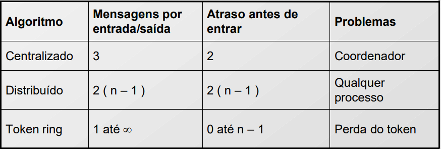

# PASSCOM: Venda Compartilhada de Passagens
## Introdução
Com o êxito do sistema VENDEPASS, disponível em [Repositório VENDEPASS](https://github.com/fabiomirs/PBL1_TEC502), três empresas optaram por se unir para compartilhar assentos disponíveis em seus voos. No entanto, cada LCC ainda mantém um servidor VENDEPASS centralizado, o que restringe a reserva de trechos apenas às rotas da respectiva companhia.
 Para implementar o compartilhamento de trechos, é necessário estabelecer uma comunicação entre os servidores via APIs REST. Com garantia de preferência para o primeiro comprador, e evitando um ponto único de falha.
Este projeto propõe uma solução baseada em uma API REST para conectar os servidores de cada companhia, permitindo que clientes acessem e reservem trechos de voos em diferentes LCCs de forma transparente.
A solução será implementada com a API REST desenvolvida para permitir a interoperabilidade entre os sistemas das companhias, permitindo que reservas de diferentes companhias sejam feitas a partir de qualquer servidor. O protocolo REST assegura a integridade das reservas e facilita a passagem dos dados sem bloqueios. Além da necessidade de lidar com a concorrência distribuída entre os servidores. Os resultados alcançados demonstram que o sistema é capaz de gerenciar as reservas de passagens de maneira eficiente e descentralizada, permitindo que os clientes escolham trechos de diferentes companhias e realizem a compra de forma intuitiva e segura. 

## Arquitetura da solução

A arquitetura da solução foi dividida em três servidores, três APIs, arquivos e clientes. Cada servidor possui sua própria quantidade específica de trechos, que são obtidos a partir de um arquivo exclusivo de cada servidor. Ou seja, cada um dos três servidores possui um arquivo com as informações de cidade de origem, cidade de destino, quantidade de passagens e o ID do servidor.

Cada servidor possui uma API baseada em HTTP com arquitetura RESTful. Isso significa que as APIs seguem os princípios REST (Representational State Transfer), um modelo arquitetural que define boas práticas para comunicação entre sistemas de forma simples e padronizada. As APIs RESTful utilizam métodos HTTP, como GET para buscar informações e POST para enviar dados, e adotam uma estrutura em que os recursos são representados em URLs claras e legíveis.
Assim, quando o cliente deseja solicitar algo, como os trechos de um servidor, ele não se comunica diretamente com o servidor, mas sim por meio de sua API. O mesmo ocorre quando um servidor precisa solicitar os trechos de outros servidores: as informações são obtidas por meio de uma requisição à API, e o servidor que recebe a requisição responde conforme necessário.

Além disso, há um cliente, que realiza a solicitação das compras. Ele pode comprar todos os trechos de um único servidor ou de diferentes servidores, montando sua rota com trechos de servidores distintos.
Por fim, toda essa aplicação foi desenvolvida com o uso do Spring Boot, uma estrutura que facilita o desenvolvimento de aplicações em Java ao oferecer um conjunto de ferramentas e configurações automáticas, agilizando a criação de aplicações web, APIs RESTful e microserviços.
Dessa forma, a arquitetura pode ser classificada como Cliente-Servidor Distribuída, permitindo que cada servidor opere de maneira independente e mantenha seu próprio conjunto de trechos, garantindo escalabilidade e facilidade de comunicação entre os servidores.

Abaixo está a explicação de cada um dos métodos utilizados na classe [CompraService](demo/src/main/java/com/example/demo/service/CompraService.java), que gerencia as tarefas dos servidores:

- getAllTrechos: Obtém todos os trechos disponíveis, tanto locais quanto de outros servidores. Para isso, faz uma chamada para a API de cada servidor, buscando os trechos e adicionando-os a um mapa.

- adicionarTrechosDeOutroServidor: Recebe a URL de outro servidor, faz uma requisição para obter os trechos desse servidor e adiciona-os ao mapa de trechos.

- compra: Gerencia a lógica de compra de uma rota específica. Solicita o token, espera pela autorização e tenta comprar os trechos, tanto localmente quanto em outros servidores, se necessário. Em caso de sucesso, atualiza as informações sobre a disponibilidade de passagens.

- tentaCompraEmOutrosServidores: Tenta realizar a compra de um trecho em outros servidores, caso não esteja disponível localmente.

- solicitarToken: Lida com a solicitação do token para acesso à região crítica do código. Tenta obter o token por um total de 5 tentativas, com intervalos de 2 segundos.

- liberarToken: Libera o token para o próximo servidor na lista. Isso é feito chamando a API do próximo servidor para notificar que ele agora é o holder do token.

- receberToken: Método que um servidor chama para receber o token. Atualiza o estado e notifica os outros servidores que estão esperando.

- iniciaRepasseContinualToken: Inicia uma tarefa que verifica se o token está sendo mantido por muito tempo e, se necessário, libera o token para o próximo servidor.

- iniciaHeartbeats: Inicia um timer que verifica periodicamente se outros servidores estão ativos, enviando um "heartbeat". Se um servidor falha, ele é removido da lista de servidores ativos.

- atualizarArquivos: Atualiza arquivos JSON com a disponibilidade dos trechos após uma compra ser realizada.

- organizarArquivo: Organiza os trechos pertencentes a um servidor específico em um formato que será salvo em um arquivo JSON.

- salvarNoArquivo: Salva os dados de trechos em um arquivo JSON no sistema de arquivos.

- compraTrechoIndividual: Permite a compra de um único trecho, verificando a disponibilidade local antes de processar a venda.

- regenerarToken: Encontra o próximo servidor ativo e passa o token para ele, caso o servidor atual não esteja mais ativo.

- montarRota: Monta todas as rotas possíveis entre duas cidades usando uma abordagem BFS (busca em largura). Ele constrói um grafo a partir de todos os trechos e procura todas as combinações possíveis de rota.

## Protocolo de comunicação

Cada servidor possui sua própria API, e todas operam de maneira semelhante, embora com dados diferentes. Cada servidor realiza operações similares, então quando deseja solicitar algo a outro servidor, chama alguns dos métodos da api para que realize a operação adequada. Além disso, clientes também podem fazer solicitações as API’s para realizarem alguma tarefa nos servidores. Abaixo está a explicação de cada um dos métodos remotos da API. Como as APIs são idênticas, a descrição se aplica a todas:

- GET /api/trechos:
  - Responsável por listar todos os trechos disponíveis no servidor, permitindo que o cliente e outros servidores acessem informações sobre todos os trechos gerenciados.
Não há parâmetros, e o retorno é um ConcurrentHashMap, onde a chave é uma String representando a combinação de cidade de origem e destino, e o valor é um objeto do tipo Trecho, que contém informações como cidade de origem, cidade de destino, quantidade de passagens e ID do servidor.

- GET /api/trecho:
  - Tem a função de retornar todos os trechos disponíveis, semelhante ao anterior, fornecendo uma maneira alternativa de acessar a lista de trechos.
Não há parâmetros, e seu retorno é um ConcurrentHashMap contendo os trechos disponíveis, representados como descrito anteriormente.

- GET /api/ready:
  - Serve para verificar se o servidor está ativo e pronto para atender requisições, permitindo que outros servidores chequem rapidamente o status. Essa verificação é especialmente útil para identificar se algum servidor saiu do ar, garantindo que o token ring funcione adequadamente em caso de falha.
Não há parâmetros, e seu retorno é uma String com a mensagem “OK” se o servidor estiver operacional.

- POST /api/comprar:
  - Utilizado para realizar a compra de passagens de uma rota escolhida pelo cliente, processando a operação com base na rota fornecida.
Possui como parâmetro uma lista de objetos do tipo Trecho representando a rota escolhida, e o retorno é uma String com o resultado da compra. Se a rota estiver vazia, a mensagem de erro correspondente é retornada.

- GET /api/liberarPermissao:
  - Empregado para liberar um token para o próximo servidor, permitindo que o servidor atual conceda permissão para que outros servidores realizem operações.
Possui como parâmetro o ID do servidor que está recebendo a permissão, e não há retorno.

- GET /api/heartbeat:
  - Verifica a saúde do servidor, permitindo que outros servidores monitorem o status de operação. Essa função é especialmente utilizada para garantir que cada servidor que recebe o token esteja "dando sinal de vida", além de ajudar a identificar se algum servidor caiu.
Não há parâmetros, e o retorno é um ResponseEntity com a mensagem “OK”, indicando que o servidor está ativo.

- GET /api/receberToken:
  - Utilizado para receber um token, permitindo que o servidor atual tenha acesso à região crítica.
Não há parâmetros nem retorno.

- POST /api/comprarTrecho:
  - Destina-se à compra de um trecho individual com base na origem e no destino, facilitando a aquisição de um trecho específico em vez de uma rota completa.
Possui como parâmetros a cidade de origem e o destino, retornando uma String com o resultado da compra.

- POST /api/atualizarTrecho:
  - Responsável por atualizar as informações de um trecho existente, permitindo modificar dados como a quantidade de passagens.
Possui um objeto do tipo Trecho como parâmetro e retorna um ResponseEntity com uma mensagem de confirmação, indicando que o trecho foi atualizado com sucesso.

- GET /api/shutdown:
  - Utilizado para desligar o servidor. Não possui parâmetros e retorna uma String informando que o servidor está se desligando.

- POST /api/montarRota:
  - Esse método ajuda a montar uma rota com base em uma origem e um destino, permitindo que o cliente descubra possíveis rotas entre duas cidades, facilitando a compra de passagens.

 ## Roteamento
 O cálculo distribuído das rotas entre a origem e o destino das passagens é realizado pelo método montarRota(String origem, String destino). Este método coleta todos os trechos disponíveis em um ConcurrentHashMap e constroi um grafo, onde cada cidade de origem é mapeada para uma lista de trechos correspondentes.
Utilizando uma busca em largura (BFS), o método explora todos os caminhos possíveis a partir da cidade de origem. Para cada trecho, ele verifica se o destino corresponde ao desejado. Se sim, essa rota é armazenada; caso contrário, o algoritmo continua a busca explorando os trechos que partem do destino atual.

Ao final, o método retorna uma lista de listas de trechos (List<List<Trecho>>), representando todas as rotas possíveis entre a origem e o destino. Assim, o sistema permite que os usuários visualizem todas as opções de viagem disponíveis, aproveitando a comunicação eficiente entre os servidores.
Além disso, para apresentar as rotas com base nos trechos disponíveis em outros servidores, é feita uma chamada a um método que concatena todos os trechos de todos os servidores em uma estrutura, permitindo mostrar, de forma momentânea, o resultado das rotas.

## Concorrência Distribuída

Para resolver a distribuição de tarefas entre os servidores, foi utilizado um algoritmo conhecido como token ring, com algumas adaptações para atender às necessidades do sistema. O token ring é uma estrutura de comunicação onde apenas o servidor que possui o "token" pode acessar a região crítica, ou seja, a área do sistema onde as modificações de dados ocorrem.

- A lógica principal do algoritmo pode ser descrita da seguinte maneira:
  - Um anel lógico é definido no sistema.
  - Cada processo é associado a uma posição do anel.
  - Cada processo conhece seu sucessor .
  - Há uma marca (token) que fica circulando pelo anel e é essa marca que dá direito a um processo acessar a região crítica.
  - Quando um processo adquire a marca, ele checa para ver se precisa entrar na região crítica.
  - Se precisar, entra na região, efetua o trabalho e sai da região.
  - Depois de sair, passa a marca para o próximo processo do anel.
  - Não é permitido entrar em uma 2ª região crítica usando a mesma marca.
 
A descrição visual da lógica do algoritmo pode ser visualizada na figura abaixo, tendo a existência de 3 servidores, cada um representando por um computador. E o token representado pelos anéis sendo passados.

<p align="center"><strong></strong></p>
<p align="center">
  
</p>
<p align="center"><strong>
</strong> Figura 1. Representação visual Token Ring.</p>

Quando um servidor recebe o token, ele tem a permissão para realizar alterações nos dados. Se, por algum motivo, esse servidor não quiser modificar os dados naquele momento, o token é passado para o próximo servidor, criando assim um ciclo em que o token circula entre os servidores.

Uma das principais adaptações feitas ao algoritmo original foi a implementação de um sistema de tentativas. Quando um servidor não está com o token, ele tem até cinco tentativas para solicitá-lo novamente. Então, após uma tentativa, espera dois segundos e tenta de novo, isso, até atingir o limite de tentativas. Se ainda não conseguir, a venda não é realizada. Essa abordagem permite que o sistema continue funcionando de forma eficiente, minimizando o tempo de espera e evitando bloqueios prolongados. Lembrando, que foram fixadas cinco tentativas pelo fato da comunicação ser feita entre apenas três servidores, se caso, a implementação seja com uma comunicação entre mais de vinte servidores por exemplo, esse número de tentativas deve ser trocado. 

Além disso, para evitar que um token fique preso em um único servidor, foi estipulado que, caso o token permaneça inativo, ele deve ser passado para o próximo servidor dentro de um período de 10 segundos. Essa estratégia assegura que outros servidores tenham a oportunidade de realizar modificações em seus dados, garantindo uma melhor distribuição de tarefas.
Quando um cliente decide comprar uma passagem, ele envia uma requisição HTTP para a API. A API, então, comunica ao servidor responsável, que solicita o token. Assim que recebe o token, o servidor realiza as verificações necessárias. Se a passagem não estiver disponível em seu próprio banco de dados, ele faz uma requisição a outro servidor para que este verifique a disponibilidade da passagem. Essa abordagem assegura que apenas o servidor que está com o token possa realizar modificações nos dados, evitando problemas como a venda excessiva de passagens ou a venda da mesma passagem para diferentes clientes.

Para garantir a consistência e a confiabilidade dos dados, foram implementados arquivos para o armazenamento físico das informações. Após o encerramento de um servidor, os dados permanecem seguros, pois estão armazenados em arquivos. Assim, mesmo que um servidor que possua o token caia, ele não perde suas informações, pois os dados estão preservados. Para garantir a continuidade do sistema, o token é regenerado após um certo período, permitindo que o próximo servidor que necessitar dele possa obtê-lo facilmente.

Para adicionar a implementação do algoritmo do token ring, foi fundamental o planejamento de alguns pontos fundamentais, que aconteceram a parte da realização de uma compra propriamente dita, são eles:

- Solicitação do Token: O servidor atual verifica se é o titular do token (token holder). Se não for, ele aguarda a liberação do token pelo titular atual.
- Liberação do Token: Quando o servidor atual conclui o uso do token, ele o libera para o próximo servidor na lista.
- Recebimento do Token: O próximo servidor na lista recebe o token, que é indicado por uma chamada ao método receberToken.
- Heartbeat e Monitoramento: Os servidores enviam e monitoram heartbeats periodicamente para verificar se todos os servidores estão ativos. Se o servidor titular do token falha, o token é regenerado e atribuído ao próximo servidor ativo.

Para exemplificar a utilização do token ring será demonstrado a interação dos três servidores distintos, A, B e C, cada um responsável por um trecho de voo. O objetivo é ilustrar como esses servidores colaboram para processar uma compra de passagem, gerenciando a comunicação entre eles através de um protocolo de rede específico. Durante o processo, o Servidor A atuará com a conexão do cliente que solicita informações e efetua a compra, enquanto os Servidores 2 e 3 responderão com detalhes sobre a disponibilidade dos trechos solicitados. 
Na imagem abaixo é possível visualizar esse processo. Com o objetivo de destacar a importância da coordenação e da integridade das transações em um ambiente distribuído. Demonstrando também como o sistema gerencia conflitos e garante que as operações sejam realizadas de forma eficiente e segura. Considerando o algoritmo implementado, o processo de compra só se dá no momento em que o servidor detém o token, visto que será o momento de acesso a região crítica.

<p align="center"><strong></strong></p>
<p align="center">
  
</p>
<p align="center"><strong>
</strong> Figura 2. Diagrama de sequência do processo de compra.</p>


O token ring foi escolhido em detrimento de outras opções de coordenação, como o relógio de Lamport ou o algoritmo de(Ricart e Grawalla), por apresentar vantagens específicas para este cenário de concorrência distribuída. A principal característica do token ring é o uso de um token exclusivo que circula entre os servidores, permitindo o acesso à região crítica somente ao servidor que detém o token no momento. Essa abordagem é particularmente vantajosa para um sistema em que o número de servidores é limitado e as operações críticas são frequentes e exigem sincronização estrita.

O token ring oferece uma forma de controle direto sobre o acesso à região crítica, eliminando a necessidade de monitoramento constante de eventos distribuídos. Em comparação, o relógio de Lamport usa timestamps lógicos para manter a ordem de eventos em sistemas distribuídos, o que pode ser mais complexo e aumentar a sobrecarga em cenários de alta concorrência.

Com as adaptações implementadas, como a regeneração do token em caso de falhas, o token ring proporciona uma solução resiliente e eficiente, garantindo que o sistema permaneça ativo mesmo que um servidor específico caia. Por outro lado, o relógio de Lamport requer re-sincronização de eventos após falhas, o que pode impactar a continuidade do sistema.

Na tabela abaixo, é possível observer o comparativo de alguns elementos principais na implementação de um algoritmo de concorrência distribuida:

<p align="center"><strong></strong></p>
<p align="center">
  
</p>
<p align="center"><strong>
</strong> Tabela 1. Comparativo na implementação de algoritmos.</p>

## Confiabilidade da solução
A partir do momento em que um servidor é iniciado, ele coleta suas informações, como as cidades de origem, destino, quantidade de passagens e ID do servidor, a partir de um arquivo. Como mencionado, cada servidor possui um arquivo diferente, contendo as informações específicas daquele servidor. Caso um servidor não seja iniciado, é feita a leitura apenas dos trechos disponíveis nos servidores ativos. O mesmo se aplica caso um servidor esteja ativo e seja desativado por algum motivo; a coleta não é realizada, e o método que faz as buscas em todos os servidores retorna apenas os dados dos servidores ativos.

Isso é possível graças a uma técnica chamada heartbeats, na qual cada servidor envia sinais de "batimento" para todos os outros servidores na rede, informando que está ativo e funcionando corretamente. Esses batimentos não são enviados para um controlador central, mas para todos os servidores, permitindo que cada um monitore a atividade dos demais. Assim, antes de cada operação que envolva a comunicação entre os servidores, é feito esse mapeamento dos heartbeats para verificar a atividade do servidor.

Além disso, foi realizado um teste em que um servidor está inicialmente conectado e é feita uma compra nele. Caso ele caia antes da atualização da compra no arquivo, essa transação não é contabilizada, visto que a compra é concluída com êxito apenas após a atualização no arquivo. O sistema garante a consistência dos dados, evitando a venda duplicada de passagens, pois apenas o servidor que está ativo e com o token pode realizar a modificação dos dados. Quando um servidor que ficou offline se reconecta, ele atualiza suas informações a partir dos dados disponíveis nos servidores ativos, assegurando que a concorrência e a integridade dos dados sejam mantidas.
Com isso, na visão do usuário, caso um dos servidores que contém trecho de sua rota caia, a compra daquele trecho não é contabilizada, apenas dos servidores ativos. 


## Testes realizados

Foi feito um script em Java que simula a compra de passagens em um sistema distribuído, onde três servidores independentes processam pedidos de trechos. O cliente, representado pelo programa, envia requisições simultâneas para esses servidores, solicitando a compra e, em seguida, consulta a disponibilidade dos trechos. Com isso, o script serve como teste do funcionamento dos servidores em um ambiente de compra e venda, permitindo observar seu comportamento ao processar múltiplas requisições ao mesmo tempo.

Primeiro, algumas URLs são definidas para representar as APIs dos três servidores, cada um com uma rota para processar compras (/api/comprar) e outra para verificar trechos disponíveis (/api/trechos). Em seguida, um cliente HTTP (HttpClient) e um serviço de execução (ExecutorService) com três threads são criados para enviar as requisições de compra simultaneamente.
Um JSON (jsonPayload) especifica o trecho de passagem desejado — por exemplo, uma viagem de "São Paulo" para "Rio de Janeiro" — e é enviado nas requisições de compra. O programa usa o ExecutorService para enviar as requisições POST de compra aos três servidores. Cada requisição usa a função sendPostRequest, que envia o JSON e exibe a resposta, indicando se a compra foi bem-sucedida ou se ocorreu um erro.
Após as requisições, o executor.shutdown() garante que todas as tarefas terminem antes de seguir para a consulta de disponibilidade dos trechos. Finalmente, as requisições GET são enviadas para verificar quantos trechos ainda estão disponíveis após as compras, usando sendGetRequest para exibir as respostas dos servidores.

Esse script é útil para avaliar como um sistema de passagens se comporta sob múltiplas requisições simultâneas e verificar a disponibilidade de trechos após cada compra.


Além disso, foi criado um script no estilo HTTP que realiza requisições específicas aos servidores. Esse script inclui nove casos que têm como objetivo testar a funcionalidade dos servidores em diversos cenários práticos. Abaixo, uma explicação sobre cada cenário testado:

Caso 1: Um cliente no Servidor A solicita a montagem de uma rota entre São Paulo e Rio de Janeiro. Essa requisição tenta preparar a rota para futuras compras.

Caso 2: No Servidor B, o cliente pede para montar uma rota entre Campinas e Belo Horizonte, preparando outro trecho para compras futuras.

Caso 3: No Servidor C, o cliente solicita a montagem de uma rota entre Brasília e Salvador, configurando uma nova opção de trecho no servidor.

Caso 4: Um cliente no Servidor A realiza a compra de uma rota completa, conectando São Paulo, Campinas e Rio de Janeiro. A requisição específica uma série de trechos para serem comprados como uma rota integrada.

Caso 5: No Servidor B, o cliente realiza a compra de um único trecho entre Campinas e Belo Horizonte, útil quando o cliente deseja apenas uma parte da rota.

Caso 6: Um cliente no Servidor C tenta comprar uma rota com múltiplos trechos, indo de Brasília para Goiânia e depois para Salvador. Esse cenário testa a compra de uma rota completa com múltiplas paradas.

Caso 7: No Servidor A, o cliente tenta comprar um trecho inexistente entre Manaus e Fortaleza. Esse caso verifica se o sistema lida corretamente com tentativas de compra para rotas que não foram previamente cadastradas.

Caso 8: No Servidor C, o cliente verifica o heartbeat do servidor, confirmando que o servidor está ativo e funcional. Essa operação retorna uma confirmação do status de disponibilidade do servidor.

Caso 9: No Servidor A, o cliente realiza uma requisição para desligar o servidor, testando o processo de shutdown. Este é um cenário de gerenciamento que verifica se o sistema responde adequadamente ao comando de desligamento.

Esses casos de teste são úteis para avaliar o comportamento e a resiliência dos servidores em situações de compra, montagem de rotas, verificações de status e gerenciamento do servidor, garantindo a funcionalidade do sistema em situações comuns e críticas.


## Docker adicionado ao sistema

Neste projeto, o uso do Docker tem como objetivo assegurar um ambiente de execução consistente e isolado, simplificando a configuração. O Docker permite que tanto o servidor quanto os clientes rodem em containers independentes, eliminando problemas de compatibilidade entre diferentes sistemas operacionais e dependências. 

## Como executar o sistema

1. **Construir o container Docker:**
Navegue até a pasta onde o arquivo Dockerfile está localizado e execute o comando abaixo para construir os containers:
    ```bash
    docker-compose build
    ```

2. **Executar o servidor:**
Ao executar este comando substitua (número do servidor) pelo valor que desejar, 1, 2 ou 3.
    ```bash
    docker-compose up servidor(número do servidor)
    ```

**Adicionar clientes:**

3. **Criar um único cliente por vez:**
Ao executar este comando substitua (número do cliente) pelo valor que desejar, 1, 2 ou 3.
    ```bash
    docker-compose up cliente(número do cliente)
    ```


## Conclusão

A implementação do sistema de reservas aéreas foi realizada com eficácia, possibilitando que os clientes interajam com o serviço de aviação de maneira fluida e segura. Através do uso de APIs REST e contêineres Docker, foi estabelecida uma comunicação eficiente entre os servidores das LCCs, permitindo que os clientes escolham trechos de diferentes companhias de forma descentralizada. Os objetivos do projeto foram alcançados, promovendo uma operação confiável e resiliente para as companhias participantes.

## Equipe

- Fábio S. Miranda
- Armando de Lima Almeida

## Tutor

- Antonio A T R Coutinho

## Referências

TANENBAUM, A. S.; VAN STEEN, M. Distributed Systems: Principles and Paradigms. Pearson, 2016.

COULOURIS, G.; DOLLIMORE, J.; KINDBERG, T.; BLAIR, G. Distributed Systems: Concepts and Design. Addison-Wesley, 2011.

CARACTERÍSTICAS do Token Ring: guia completo. Disponível em: [token-ring](https://www.facom.ufms.br/~ricardo/Courses/DisSys/Material/SD-Aula-09.PDF). Acesso em: 1 nov. 2024.

LDF GRUPO. Token Ring: características. Disponível em: https://ldfgrupo.pt/blog/token-ring-caracteristicas/ Acesso em: 1 nov. 2024.
